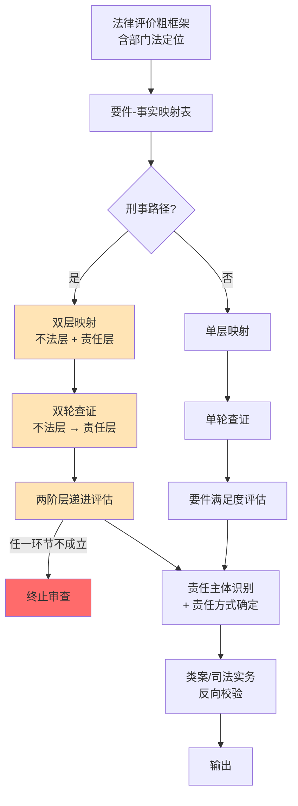
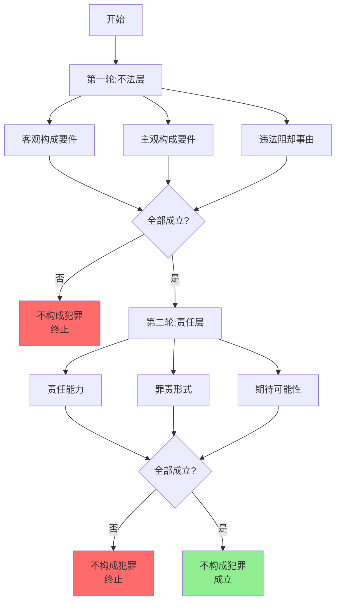

# 法律分析的方法论手册 v1.0（两阶层修订版）

**从事实到法律评价的可操作路径**

---

## 前言

> [!info] 核心命题
> 法律分析的标准路径是"**事实查证 → 法律评价 → 责任承担**"。但"事实查证"不是独立的查证，是由**法律评价反向定义**的——你不需要查清所有事实，只需要查清"对法律评价有方向性影响"的事实。

> [!example] 刑事路径的两阶层体系
> **不法层** = 构成要件该当性（客观构成要件 + 主观构成要件）+ 违法性（违法阻却事由审查）；
> **责任层** = 有责性（责任能力 + 罪责形式 + 期待可能性）。
> 审查顺序**严格递进**——不法层任一要件不成立即终止审查；不法层成立后进入责任层审查，任一责任要件不成立即不构成犯罪。

**适用对象**：法律工作者、法律科技产品、AI 法律分析系统、跨学科研究者。

**本手册不替代**：法律人的经验判断、价值判断、伦理判断。方法论是**降低错误率的工具，不是保证正确的工具**。

**阅读路径**：
- 第一次读：按 1—8 章顺序读，建立框架；
- 实战用：直接查第 7 章清单，按清单操作；
- 复盘用：回到第 5 章失败模式 + 第 6 章元规则；
- 培训用：用第 8 章使用建议 + 附录实战样本。

---

## 第一章：方法论总则

### 1.1 法律评价的两类产出

| 产出 | 对应工作 | 颗粒度要求 |
|---|---|---|
| **法律评价** | 民事请求权基础 / 行政违法 / **刑事两阶层体系**（不法层 + 责任层） | 精准 |
| **责任承担** | 民事赔偿 / 行政处罚 / 刑罚 + 责任主体 + 责任方式 + 免责抗辩 | 合理 |

**刑事两阶层体系展开**：

```
不法层
　├─ 构成要件该当性
　│　　├─ 客观构成要件（行为、对象、结果、因果关系、行为时地等）
　│　　└─ 主观构成要件（故意 / 过失、目的等）
　└─ 违法性
　　　　├─ 形式违法（违反刑法规范）
　　　　└─ 实质违法（法益侵害） + 违法阻却事由（正当防卫、紧急避险、依法执行职务、被害人承诺等）

责任层
　├─ 责任能力（年龄、精神状态、辨认控制能力）
　├─ 罪责形式（故意 / 过失、罪责程度）
　└─ 期待可能性（缺乏期待可能性的责任阻却）
```

### 1.2 三类输入的难度光谱

| 输入类型 | 特征 | 典型场景 | 难点 |
|---|---|---|---|
| **生活事实** | 微观、个案、行为人可识别 | 邻居装修砸了承重墙 | 涵摄（subsumption）准确 |
| **客观事实** | 中观、跨主体、可观察需定性 | APP 违规收集人脸信息 | 法益识别 + 部门法定位 |
| **复杂社会现象** | 宏观、系统性、多主体多环节 | 烂尾楼集中爆发、业主停贷 | 链条还原 + 多层归责 + 程序实体并行 |

### 1.3 标准流水线（含反向定义）



> [!warning] 关键提示
> 刑事路径的"双层映射"和"双轮查证"是**两阶层体系在方法论上的具体体现**——不法层和责任层的审查**不能合并**，必须**递进进行**。不法层不成立就**不进入责任层**——这避免了在非法占有目的、罪责形式等主观要件上**空转**。

---

## 第二章：法律评价如何反向定义事实查证

> [!info] 核心命题
> 事实查证不是"查清所有相关事实"，而是"**法律评价框架告诉你需要哪些事实，每个事实查到什么颗粒度**"。

**操作工具**：

1. **要件—事实映射表**（Subsumption Checklist）——三栏结构：法律要件 / 所需事实 / 查证颗粒度
2. **两阶层双层映射规则**——刑事路径下，不法层要件—事实映射 + 责任层要件—事实映射**分开做**、**递进做**；
3. **反向假设法**——假设事实存在 / 不存在，跑法律评价，看主结论是否反转；
4. **停止判断标准**——当新增事实查证对法律评价**不产生方向性影响**时，停止查证。

**两阶层下的特殊操作**：

- **不法层映射的颗粒度要求**：客观构成要件查证到"行为时点 + 行为方式 + 行为对象 + 因果关系"；主观构成要件查证到"目的 / 动机 + 故意 / 过失的具体形式"；
- **违法性映射的颗粒度要求**：形式违法（违反刑法规范的对应条款）+ 实质违法（法益侵害的具体类型） + 违法阻却事由的对应事实（防卫起因 / 避险紧迫性 / 职务合法性 / 承诺范围）；
- **责任层映射的颗粒度要求**：责任能力（年龄证据 / 精神鉴定）+ 罪责形式（主观要件的证据链）+ 期待可能性（行为人处境的证据）。

> [!warning] 失败信号
> - 映射表做不出来 → 法律定位未完成；
> - 所有事实都标"关键" → 没做反向假设；
> - 关键事实停留在"待查证"且**无查证路径** → 需要切换法律评价路径；
> - **刑事路径专属**：不法层未查实就进入责任层查证 → 方法论顺序错误；
> - **刑事路径专属**：主观构成要件查证颗粒度不够 → 罪责形式无法判断。

---

## 第三章：不同部门法的查证深度差异

**核心命题**：同一个事实，在不同部门法下需要的查证深度不同。"透彻"是相对值。

**证明标准三档**：

| 标准 | 适用 |
|---|---|
| 排除合理怀疑 | 刑事 |
| 证据确凿 | 行政处罚 / 行政诉讼审查行政行为 |
| 高度盖然性 | 民事 |

**举证责任分配**（决定**当事人自己**要查多少）：

- 刑事：公诉方举证；
- 民事：谁主张谁举证；
- 行政（处罚）：行政机关举证；
- 行政（诉讼）：被告行政机关举证。

**路径选择原则**：

> [!danger] 路径选择硬规则
> **先评估"我能获取什么证据"，再选法律评价路径**。
> ——这一条是民间借贷 vs 借款型诈骗案暴露的关键方法论命题。

**刑事路径下的双轮查证规则**：



| 查证轮次 | 内容 | 颗粒度 | 终止条件 |
|---|---|---|---|
| **第一轮：不法层** | 客观构成要件 + 主观构成要件 + 违法阻却事由 | 行为时点 + 行为方式 + 主观状态 + 阻却事由的对应事实 | 客观构成要件不成立 / 主观构成要件不成立 / 违法阻却事由成立 → **不构成犯罪，终止** |
| **第二轮：责任层** | 责任能力 + 罪责形式 + 期待可能性 | 年龄证据 + 精神状态 + 主观要件证据链 + 行为人处境 | 责任能力缺失 / 主观无故意或过失 / 无期待可能性 → **不构成犯罪，终止** |

——**第二轮的进入前提是第一轮全部成立**。这一条是民间借贷 vs 借款型诈骗案暴露的关键方法论命题。

---

## 第四章：三类输入场景的应用差异

| 场景 | 清单颗粒度 | 重点环节 | 常见失败 |
|---|---|---|---|
| **生活事实** | 简化版（清单 1 压到 3 项） | 涵摄准确、要件—事实对应 | 事实过载、要件遗漏 |
| **客观事实** | 标准版（三张清单全用） | 法益识别、跨部门法定位 | 部门法误用、主体错位 |
| **复杂社会现象** | 详尽版（三张清单 + 时点 + 主体 + 因果链细分） | 链条还原、多层归责、程序实体并行 | 因果链断裂、时空错位、政策考量遗漏 |

**复杂社会现象额外需要**：

- 政策考量维度——在映射表外单独列出；
- 程序与实体并行处理——先程序后实体的判断节点；
- 多主体责任分担——直接行为人 / 监督者 / 帮助者 / 共同侵权 / 雇主 / 平台责任的分别评估；
- **刑事子场景额外需要**：两阶层双层映射 + 双轮查证 + 不法层 / 责任层分开评估。

---

## 第五章：常见失败模式与校正

> [!warning] 六类基础失败模式 + 三类刑事路径专属失败模式
> 这九类失败模式在实战中**几乎全部命中过**——务必对照检查。

| 失败模式 | 校正工具 |
|---|---|
| 事实过载 | 映射表打分，法律权重低的查证要克制 |
| 事实遗漏 | 映射表强制检查点 + 抗辩要件反向补全 |
| 事实错位 | 跨部门法路径重新做事实评价 |
| 时空错位 | 每个事实标注时间点，与法律评价时点对齐 |
| 主体错位 | 事实查证第一步是主体识别，不是行为识别 |
| 因果链断裂 | 区分事实因果与法律因果，**法律因果是独立的查证环节** |
| **刑事路径专属：双层映射合并** | 不法层与责任层**必须分开映射、递进审查**——合并会导致主观要件空转 |
| **刑事路径专属：违法阻却漏查** | 形式违法审查后**必须独立审查违法阻却事由**——正当防卫 / 紧急避险等 |
| **刑事路径专属：期待可能性漏查** | 责任层审查时**必须独立审查期待可能性**——尤其在义务冲突、规范冲突情境 |

---

## 第六章：方法论的元规则

### 6.1 可靠性的三层

| 层次 | 含义 | 难度 |
|---|---|---|
| 程序性可靠 | 方法论跑完了、所有步骤做了、有记录 | 最低——靠纪律 |
| 实体性可靠 | 结论与类案 / 司法实务一致 | 中——需要判例库 |
| 结果性可靠 | 实际结果印证 | 最高——靠时间和外部反馈 |

### 6.2 核心警示

> **方法论跑通 ≠ 结论正确。**
> **方法论是降低错误率的工具，不是保证正确的工具。**

### 6.3 最危险的误用

> [!danger] 最危险的误用
> "我跑过方法论了，结论肯定对。"
> ——形式完备带来过度自信，**比不跑方法论更危险**。

### 6.4 方法论不能消除的东西

- 不可形式化的法律判断（经验、直觉）；
- 道德 / 政策因素；
- 程序法对实体法的硬约束；
- 价值判断的不可推出来（评价者立场）；
- 方法论自身的盲点；
- **两阶层体系本身的争议**——两阶层 vs 四要件的学理争议持续存在，本手册选择两阶层**作为操作工具**而非唯一真理。

——**承认边界比假装没有边界更可靠**。

---

## 第七章：健康检查清单

> [!check] 三张清单作为强制质量门
> **清单 1**：要件—事实映射完整性（启动时点 = 法律评价启动后）
> **清单 2**：反向假设法质量门（启动时点 = 事实查证过程中持续）
> **清单 3**：类案/司法实务一致性（启动时点 = 结论交付前）
> 任何一项勾不上 → 评价存在已知漏洞，**必须补做或标注**——不能跳过。

### 清单 1：要件—事实映射完整性检查（6 项）

□ 1.1 已识别本案适用的法律框架（部门法 + 具体法律 / 司法解释）
　→ **失败信号**：写不出"部门法 + 具体条文"。

□ 1.2 已列出该法律框架下所有构成要件 / 请求权基础要件
　→ **刑事路径专属**：已分别列出**不法层要件**和**责任层要件**，**未合并**。
　→ **失败信号**：写不出具体款项，或刑事路径下两层要件未分开。

□ 1.3 每个要件都有对应的事实陈述
　→ **刑事路径专属**：每个不法层 / 责任层要件都有对应的事实，**未遗漏主观构成要件和违法阻却事由**。
　→ **失败信号**：要件有但对应事实缺失。

□ 1.4 每个对应的事实都标注了**法律权重**（高 / 中 / 低 / 边缘）
　→ **失败信号**：所有事实都标"高"。

□ 1.5 标注了**待核实事实**清单（含查证路径）
　→ **刑事路径专属**：区分了**不法层待核实事实**和**责任层待核实事实**——责任层查证**必须**等不法层查实后才启动。
　→ **失败信号**：没有"待核实"事实。

□ 1.6 检查了**抗辩 / 免责 / 阻却事由**对应的要件
　→ **刑事路径专属**：已列出**违法阻却事由**（正当防卫、紧急避险、依法执行职务、被害人承诺等）和**责任阻却事由**（责任能力缺失、无期待可能性等）。
　→ **失败信号**：只列了控方要件，没列阻却事由。

### 清单 2：反向假设法（质量门）检查（5 项）

□ 2.1 识别出"关键事实 vs 边缘事实"
　→ **刑事路径专属**：不法层关键事实和责任层关键事实**分别识别**。
　→ **失败信号**：所有事实都标"关键"。

□ 2.2 对每个关键事实做了反向假设演练
　→ **刑事路径专属**：对"非法占有目的""故意 / 过失形式"等主观构成要件**重点演练**——这是反向假设法在两阶层体系下**最关键的运用场景**。
　→ **失败信号**：跑不出"结论反转"。

□ 2.3 关键事实的查证状态明确（已查实 / 待查证 / 不可获取）
　→ **刑事路径专属**：主观构成要件的查证状态**特别标注**——主观要件查证手段受限是刑事案件的常见困境。
　→ **失败信号**：关键事实停留在"待查证"且**无查证路径**。

□ 2.4 边缘事实的处理策略明确（查 / 不查 / 简化查）
　→ **失败信号**：所有事实都查。

□ 2.5 不可获取事实的影响已评估
　→ **刑事路径专属**：不可获取事实如**影响主观构成要件成立**（如借款时对方真实财务状况），需特别评估对整个刑事路径的影响。
　→ **失败信号**：忽略不可获取事实。

### 清单 3：类案 / 司法实务一致性检查（5 项）

□ 3.1 已检索类案（至少 3—5 个核心类案 + 不同法院层级）
　→ **刑事路径专属**：检索同类两阶层体系下的实务判例——特别是"借款型诈骗""民间借贷纠纷与诈骗罪区分"等典型场景。
　→ **失败信号**：没做类案检索。

□ 3.2 类案结论与本评价的一致 / 不一致已分析
　→ **失败信号**：跳过不一致。

□ 3.3 已检索司法解释 / 会议纪要 / 指导意见 + 最高法 / 最高检指导案例
　→ **刑事路径专属**：检索两阶层相关司法解释（如关于非法占有目的推定规则、违法阻却事由认定标准等）。
　→ **失败信号**：只看法条不看司法解释。

□ 3.4 检索了不同层级法院的判决分布
　→ **失败信号**：只看最高法或只看基层。

□ 3.5 类案检索结果已写入评价记录
　→ **失败信号**：检索过但没写入。

### 清单使用规则

- 清单 1 启动时点 = 法律评价启动后；
- 清单 2 启动时点 = 事实查证过程中**持续**做；
- 清单 3 启动时点 = 结论交付前；
- 任何一项勾不上 → 评价存在已知漏洞，**必须补做或标注**——不能跳过；
- **刑事路径专属使用顺序**：清单 1 完成后**先做不法层映射**→ **不法层查实后再做责任层映射**→ 任一层不成立即**终止评价**。

---

## 第八章：使用建议与边界声明

### 8.1 何时启用本方法论

- 建议启用：法律评价对象有 2 个以上要件、需要跨主体归责、涉及跨部门法、有时间压力、需交付他人复核。
- 可简化启用：单一要件、单一主体、事实清晰的小额纠纷。
- 不必启用：极简单案件（如普通程序性事务）。

### 8.2 迭代规则

- 每完成一次评价 → 强制复盘（三张清单哪里没勾上、为什么没勾上）；
- 复盘结果 → 作为方法论本身的修正输入；
- 手册本身要定期更新版本号（v1.0 → v1.1 → v2.0）。

### 8.3 与法律人 / AI 的关系

- 方法论不替代法律人——法律人的经验判断、价值判断、对客户的理解、伦理判断无法形式化。
- 方法论辅助法律人——降低错误率、提高可辩护性、便于团队协作、便于知识沉淀。
- **AI 介入环节**（2026 年视角）：
  - 可介入：清单初稿生成、要件—事实映射表模板填充、**两阶层双层映射的并行生成**、类案检索、反向假设法模拟；
  - 不可介入：价值判断、政策考量、伦理判断、客户立场、评价者立场、**两阶层与四要件的学理选择（属于方法论本身的选择，需由人定）**。
- AI 介入的风险：上一段"最危险的误用"在 AI 时代被放大——AI 跑完清单的"形式完备"程度比人还高，过度自信的风险也更高。

**本方法论手册已嵌入到 8 个 tkk-* skill 的工作流中**：
- [[tkk-legal-review]]（v1.1.0）：两阶层 + 清单 1/2/3 嵌入审查流程
- [[tkk-defense-mind]]（v1.1.0）：出罪辩护用不法层 / 罪轻辩护用责任层
- [[tkk-judge-review]]（v1.1.0）：法官视角两阶层评估
- [[tkk-legal-deep-research]]（v2.2.0）：六步流程方法论嵌入
- [[tkk-discover]]（v2.5.1）：候选元问题 + 反对者审查
- [[tkk-legal-ingest]]（v67.1）：内容提取阶段事实-要件元数据
- [[tkk-injury-evaluator]]（v1.1.0）：三栏目对接（工伤 + 人损 + 刑事两阶层）
- [[tkk-audit-review]]（v1.1.0）：证据三性 → 要件映射

详细升级日志见 [[tkk-skills-methodology-upgrade-2026-06-23]]。

### 8.4 不适用场景

- 涉及高度伦理判断的案件（如生命权冲突、安乐死、堕胎等）；
- 法律本身不明确的新兴领域（如 AI 责任、加密资产、算法歧视）；
- 政治性极强、价值判断占主导的案件；
- **学理争议未定的场景**——两阶层 vs 四要件的学理争议持续存在，本手册选择两阶层作为操作工具，但在必须使用四要件的司法辖区或学术场合需另行处理。

——这些场景方法论能辅助，但不能主导。

---

## 附录 A：实战样本（两阶层修订版）

> [!example] 实战样本
> 民间借贷纠纷 vs 借款型诈骗罪控告（用户实际案例，已脱敏）——演示方法论清单 1/2/3 + 两阶层双层映射的完整应用。

**样本**：民间借贷纠纷 vs 借款型诈骗罪控告（用户实际案例，已脱敏）

**事实摘要**：

- 借款人向出借人借 3 万元；
- 借款人借款时为失信被执行人，**未告知**出借人；
- 借款时**未约定用途**；
- 借款时**无凭证**；
- 借款到期后，借款人**以"在凑钱"为由拖延不还**；
- 借款人**未变更联系方式**、**未失联**；
- 现知借款人**对外有许多借款**（借款时是否已存在待证）；
- 失信原因：**未履行法院生效判决**。

### 第一步：法律评价粗框架

- 民事路径：民间借贷纠纷（《民法典》合同编借款合同章）；
- 刑事路径：借款型诈骗罪（**两阶层体系**）。

### 第二步：刑事两阶层双层映射

**不法层**：

| 要件 | 所需事实 | 查证状态 | 评价 |
|---|---|---|---|
| **客观构成要件：欺骗行为** | 虚构事实 / 隐瞒真相 | 已查实：隐瞒失信身份；**借款时未约定用途**（无虚构） | **部分不成立**——隐瞒失信身份**不构成诈骗罪意义上的欺骗行为**（失信身份≠无偿还能力） |
| **客观构成要件：被害人基于错误认识处分财产** | 错误认识 → 处分 | 已查实：基于熟人关系借款，非基于对方披露的偿债能力信息 | **不成立**——错误认识与处分财产**无法律因果** |
| **客观构成要件：因果关系** | 欺骗行为 → 错误认识 → 处分 → 损害 | 已查实：处分事实存在，但与欺骗行为无因果 | **不成立** |
| **主观构成要件：非法占有目的** | 借款时已无偿债能力 / 用途虚假 / 借款后挥霍转移逃匿 | 已查实：借口"在凑钱"+ 未失联 + 未变更联系方式 + 未发现挥霍转移 | **不成立**——"在凑钱"是**民事违约陈述**，无任何挥霍 / 转移 / 赌博 / 失联的内容 |
| **违法性：形式违法 + 实质违法** | 违反刑法规范 + 法益侵害 | **审查被前置终止**——因构成要件不成立 | —— |
| **违法阻却事由** | 正当防卫 / 紧急避险 / 依法执行职务 / 被害人承诺 | **审查被前置终止** | —— |

**责任层**：

| 要件 | 所需事实 | 查证状态 | 评价 |
|---|---|---|---|
| **责任能力** | 年龄 + 精神状态 | 假设正常（无反证） | 待第二轮审查 |
| **罪责形式（故意 / 过失）** | 主观要件 | —— | **第二轮审查被前置终止**——不法层不成立，不进入责任层审查 |
| **期待可能性** | 行为人处境 | —— | **第二轮审查被前置终止** |

### 第三步：反向假设法演练

| 事实 | 反向假设 | 法律评价结论变化 |
|---|---|---|
| 借款时对方是否已有"许多借款" | **假设是**——需要叠加：①数量规模足以影响偿债能力；②对方故意隐瞒；③借款后有挥霍 / 转移 / 赌博等行为印证 | **结论不变**——三项叠加才能入罪，本案事实不满足 |
| 借款时对方陈述的用途 | 假设**模糊**（"资金周转"等泛泛之词） | **结论不变**——这种泛泛之词在民间借贷中极为常见，不能认定为欺骗行为 |
| 借口内容 | 假设借口是"钱拿去赌博了 / 反正我没钱你告我去"且有证据 | **结论可能反转**——可作为"非法占有目的"的强证据 |

### 第四步：法律评价结论

> [!success] 法律评价结论
> **不法层构成要件不成立**（客观构成要件欺骗行为不成立 + 主观构成要件非法占有目的不成立）→ **终止审查，不进入责任层** → **不构成借款型诈骗罪**。

### 第五步：民事路径评价

- 请求权基础：民法典合同编借款合同章（合同定义 + 借款人还款义务）；
- 要件满足度：借贷合意 + 款项交付——**硬伤：借款无任何凭证**；
- 补救路径：催款记录（含"在凑钱"陈述）可作为自认；转账凭证作为交付证据；
- 路径评价：**民事诉讼可行但需先固定证据**。

### 第六步：方法论暴露

1. 暴露了**程序法对实体法实现的硬约束**——刑事追诉需要的证据由公安获取，民间借贷受害人没有这个手段；
2. 暴露了**直觉权重 ≠ 法律权重**——失信被执行人身份在用户心中权重 50%，法律评价下 < 10%；
3. 暴露了**事实错位**——用民事信用风险事实（失信）支撑刑事诈骗罪主张；
4. 暴露了**两阶层双层映射的价值**——本案不法层即被排除，**无需再查证责任层**——这避免了主观要件上的空转；
5. 暴露了**健康检查清单的实战用法**——三张清单跑完后，结论从用户的"构成诈骗"修正为"民事违约为主、刑事路径基本关闭"。

---

## 附录 B：进一步学习路径

### 1. 进阶阅读

**法学方法论基础**：
- 拉伦茨：《法学方法论》
- 恩吉施：《法律思维导论》
- 王泽鉴：《民法思维：请求权基础理论体系》
- 张文显：《法理学》

**刑法学两阶层体系**：
- 张明楷：《刑法学》（第六版）——两阶层体系的代表性著作
- 周光权：《刑法总论》《刑法各论》——两阶层体系
- 陈兴良：《刑法学》——三阶层 / 两阶层立场
- 刘艳红：《刑法学》——两阶层体系
- 黎宏：《刑法学总论》——两阶层体系

### 2. 工具

- 类案检索：[[yuandian-law-search]] / 北大法宝 / 威科先行
- OCR / 文档处理：[[mineru-ocr]]
- 法律研究 / 深度报告：[[tkk-legal-deep-research]]
- 风险评估：[[tkk-injury-evaluator]]
- 智能体 / 工作流：opencode / claude code

### 3. 实战训练

- 找 3—5 个真实案件（不同部门法），按本手册跑一遍；
- 对每个案件做复盘，把失败模式记下来；
- 每 3 个月更新一次手册版本号。

---

## 封口

> [!quote] 手册的核心承诺
> 这套方法论**降低法律分析的错误率，提高可辩护性，便于团队协作和知识沉淀**。
> 它**不保证结论正确，不替代法律人的经验判断和价值判断**。
> 用它的人**仍然可能错**——但错得有迹可循、有据可查、有复盘可改。
> **两阶层体系是本手册的操作工具，不是唯一真理——学理争议的存在不应被掩盖。**

**这就是工具和神谕的区别**。

---

## 版本说明

- **v1.0（两阶层修订版）**：2026 年 6 月 23 日
- **上一版本**：v1.0（四要件表述版，已废弃）
- **修订要点**：刑事路径统一采用两阶层体系；增加双层映射、双轮查证、违法阻却 / 责任阻却独立审查等操作规则；附录 A 实战样本按两阶层重写；附录 B 增加两阶层体系参考书。
- **后续计划**：作为方法论补丁注入到涉及的 tkk-* skill 工作流中（task 3）—— ✅ 已完成，见 [[tkk-skills-methodology-upgrade-2026-06-23]]。
- **Obsidian 化**：2026-06-23 同步加 frontmatter + callouts + wikilinks + mermaid 图，适配 Obsidian 知识库。
