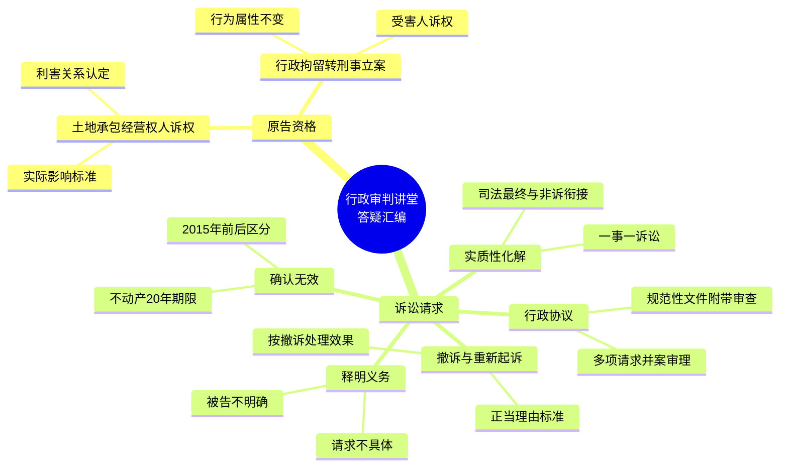

# 最高人民法院"行政审判讲堂"答疑汇编（原告资格与诉讼请求篇）

> **发布主体**：最高人民法院行政审判庭
> **整理者**：刘万金（山东省东平县人民法院原审委会专职委员、四级高级法官，山东省首届审判业务专家）
> **发布平台**：最高人民法院微信公众号
> **收录范围**：第二期至第二十五期共10个答疑问题（原告资格2题 + 诉讼请求8题）

---

## 知识网络

---

## （一）原告资格

### 知识点1：集体土地承包经营权人对强制清除地上物行为的诉权认定

**来源**：第六期问题五（提问人：江西省景德镇市中院 程丽君）

**核心规则**：判断土地承包权人是否有权起诉的法定标准之一，系行政机关强制清除地上物的行为是否对其权利义务产生**实际影响**。

**法律依据**：
- 《行政诉讼法》第2条（1989-04-04 施行 / 2017-06-27 最新修正）第1款 ✅ VERIFIED
- 《行诉解释》（法释〔2018〕1号）第69条第1款第8项 ✅ VERIFIED

**裁判要点**：

土地承包经营权人基于承包合同持有承包经营权证，享有集体土地合法物权；同时，其作为出租人又与土地承租人之间形成租赁法律关系。诉权考量须综合审查：
1. 起诉人的原告主体资格
2. 起诉时机
3. 起诉主张的权利类型
4. 诉讼请求

**核心标准**：对其合法权益是否**明显产生实际影响**，可解读为是否具有"利害关系"。

**三种处理情形**：

| 情形 | 处理方式 |
|------|----------|
| 土地承包经营权人对苗木具有合法权益且受强制清除影响 | 有权依法提起诉讼 |
| 对苗木无合法权益，仅对占用土地不服，且两行为可分 | 释明变更诉讼请求，拒绝变更则裁定驳回 |
| 已足额获得承包权益和其他补偿，且已实际交付土地 | 视为"明显不产生实际影响"，不予支持 |

① 来源：行1-45[^fn1]

---

### 知识点2：行政拘留转刑事立案后受害人诉权

**来源**：第十七期问题三（提问人：上海市高院 杨建军）

**核心规则**：公安机关转为刑事案件立案侦查后，原行政拘留决定**仍属于行政行为**，不影响其可诉性与原告主体资格认定。

**法律依据**：
- 《行政诉讼法》第25条（1989-04-04 施行 / 2017-06-27 最新修正）第1款 ✅ VERIFIED
- 《行诉解释》第12条第3项 ✅ VERIFIED

**裁判要点**：

1. 受害人认为公安机关对加害人处罚过轻的，有权提起行政诉讼
2. 即使公安机关立案侦查后不移送审查起诉、检察机关作出不起诉决定或法院判决无罪，原行政拘留决定仍可诉
3. 加害人被认定构成犯罪并判处拘役或有期徒刑时，已折抵刑期的行政拘留，亦不影响其行政行为属性
4. 合法性审查应根据**作出拘留决定时**收集的证据、事实进行
5. 认为拘留决定违法但因已折抵刑期而不具有可撤销内容的，应**判决确认违法**

① 来源：行46-60[^fn2]

---

## （二）诉讼请求

### 知识点3：诉讼请求不具体或被告不明确的处理

**来源**：第二期问题一（提问人：江西南昌铁路运输中级法院 章鹏在）

**核心规则**：人民法院须充分履行**审查、指导和释明义务**，不宜简单裁定不予立案。

**法律依据**：
- 《行政诉讼法》第49条（1989-04-04 施行 / 2017-06-27 最新修正） ✅ VERIFIED（起诉条件四要件）
- 《行政诉讼法》第51条（1989-04-04 施行 / 2017-06-27 最新修正）第3款 ✅ VERIFIED（释明义务）
- 《行诉解释》第55条 ✅ VERIFIED（一次性告知）

**三个层次的解答**：

**第一层**：起诉须有具体诉讼请求、明确被告（《行政诉讼法》第49条（1989-04-04 施行 / 2017-06-27 最新修正））

**第二层**：审查起诉阶段须充分履行指导释明义务
- 不得未经指导和释明即以起诉不符合条件为由不接收起诉状
- 须一次性全面告知补正内容、补充材料及期限
- 拒绝补正或经补正仍不符合条件的，退回诉状并记录在册

**第三层**：已进入审理程序也须充分释明
- 诉讼请求不具体但不影响实体审查的 → 依法审理后裁判
- 被告不明确但可查清适格被告的 → 裁定驳回起诉，告知适格被告

**导向**：以解决相对人实质诉求为导向，防止"群众一件事、法院多件案"

① 来源：行61-85[^fn3]

---

### 知识点4：行政协议案件中多项诉讼请求的并案审理

**来源**：第四期问题一（提问人：河北省高院 张晓鹏）

**核心规则**：原告在行政协议诉讼中可以提出若干诉讼请求，人民法院可以作为一个案件处理。

**法律依据**：
- 《行政诉讼法》第49条（1989-04-04 施行 / 2017-06-27 最新修正） ✅ VERIFIED
- 《行诉解释》第68条 ✅ VERIFIED
- 《行政协议司法解释》（法释〔2019〕17号）第9条 ✅ VERIFIED

**裁判要点**：

1. 原告提出若干诉讼请求的，法院应就各项请求是否符合起诉条件分别审查
2. 诉讼请求所依赖的法律关系可同时成立且不相互矛盾 → 同一案件审理
3. 若干请求均在同一行政协议法律关系中 → 应作为一个案件审理
4. 法律关系不同、请求相互排斥或对立 → 释明引导正确表达

**行政协议的双重属性**：行政性 + 协议性。内容可能既包括可撤销内容，也包括可继续履行内容。法院应参照《民法典》等民事法律规范作出裁判。

① 来源：行86-110[^fn4]

---

### 知识点5：行政协议案件中规范性文件附带审查

**来源**：第四期问题三（提问人：内蒙古乌海市海勃湾区法院 姚智）

**核心规则**：在行政协议案件中，原告**可以请求一并审查规范性文件**。

**法律依据**：
- 《行政诉讼法》第53条（1989-04-04 施行 / 2017-06-27 最新修正）第1款 ✅ VERIFIED
- 《行政诉讼法》第64条（1989-04-04 施行 / 2017-06-27 最新修正） ✅ VERIFIED

**关键论点**：

1. 《行政诉讼法》第53条（1989-04-04 施行 / 2017-06-27 最新修正）规定的"行政行为"应作**广义理解**，既包括单方行政行为，也包括行政协议
2. 一并审查规范性文件有利于：
   - 法院合法性审查
   - 促进诚信政府建设
   - 推动行政协议源头治理

> [!gap]+ 知识缺口
> 答疑未涉及：行政协议案件中规范性文件附带审查的具体审查标准、审查范围边界（是否限于直接依据的规范性文件），需结合《行诉解释》第145条等进一步研究。

① 来源：行111-130[^fn5]

---

### 知识点6：撤诉后重新起诉"正当理由"的把握

**来源**：第十期问题二（提问人：河南省高院 王宁）

**核心规则**：行政诉讼原告撤诉后，须以不同于第一次起诉理由的其他"正当理由"重新提起诉讼，人民法院才予立案。

**法律依据**：
- 《行诉解释》第60条第1款 ✅ VERIFIED
- 《民诉解释》第214条第1款 ✅ VERIFIED（对比参照）

**民行差异对比**：

| 维度 | 民事诉讼 | 行政诉讼 |
|------|----------|----------|
| 撤诉后重新起诉 | 应予受理 | 须有"正当理由" |
| 法律依据 | 《民诉解释》第214条第1款 | 《行诉解释》第60条第1款 |

**"正当理由"判断标准**：原告撤诉是否存在**不可归责于自身的原因**
- 例：原告因行政机关承诺解决争议而撤诉，但行政机关在合理期限内未予解决

**准予撤诉裁定错误的救济**：《行诉解释》第60条第2款 — 通过审判监督程序撤销原裁定，重新审理

① 来源：行131-155[^fn6]

---

### 知识点7：从"一行为一诉讼"向"一事一诉讼"转变

**来源**：第二十三期问题四（提问人：辽宁省高院 赵婳）

**核心规则**：人民法院应当树立**整体司法理念**，引导行政争议实质性化解、一次性解决。

**法律依据**：
- 《关于在审判工作中促进提质增效 推动实质性化解矛盾纠纷的指导意见》（法发〔2024〕16号）第1条 ✅ VERIFIED
- 《行政诉讼法》第2条（1989-04-04 施行 / 2017-06-27 最新修正）、第12条 ✅ VERIFIED
- 《行政赔偿司法解释》（法释〔2022〕10号）第27条第2款、第32条第3项 ✅ VERIFIED

**并案审理情形**：
1. 两个以上行政机关分别对同一事实作出行政行为
2. 行政机关就同一事实对多个当事人分别作出行政行为
3. 行政机关在诉讼过程中对当事人作出新的关联行政行为

**实务指引**：征迁违法强拆行政赔偿案件中，行政机关在诉讼过程中作出关联安置补偿决定的，宜引导当事人一并提起诉讼、合并审理。

① 来源：行156-175[^fn7]

---

### 知识点8："司法最终"与非诉讼纠纷解决机制的衔接

**来源**：第二十三期问题五（提问人：郑州铁路运输法院 马英武）

**核心规则**：充分发挥诉讼在多元化解纠纷机制中的**推动和保障作用**，促进行政调解、行政裁决、行政复议、行政诉讼**有机衔接**。

**裁判要点**：

1. 践行新时代"枫桥经验"，在党委领导下形成合力
2. 发挥行政复议**公正高效、便民为民**的制度优势和化解行政争议的**主渠道作用**
3. 可引导先行非诉化解的情形：
   - 适宜先行化解、调解的群体性行政争议
   - 同类争议已有生效裁判
   - 重复起诉但实质诉求合理，当事人确有法律利益需保护

**滥用诉权规制**：
- 从严掌握标准
- 审查角度：数量、周期、目的、是否具有正当利益
- 探索建立有效机制依法制止

① 来源：行176-195[^fn8]

---

### 知识点9：2015年前房屋登记请求确认无效的处理

**来源**：第二十五期问题一（提问人：河北青龙满族自治县法院 陈昭伟）

**核心规则**：确认无效规则仅适用于**2015年5月1日之后**作出的行政行为（实体从旧、程序从新原则）。

**法律依据**：
- 《行诉解释》第162条 ✅ VERIFIED
- 《行政诉讼法》第46条（1989-04-04 施行 / 2017-06-27 最新修正）第2款 ✅ VERIFIED（不动产二十年最长起诉期限）

**区分处理**：

| 情形 | 处理方式 |
|------|----------|
| 登记行为作出已超过二十年 | 依法当场裁定不予立案，无需释明 |
| 登记行为作出未超过二十年 | 审查是否知道/应当知道登记内容，是否存在扣除/延长事由 |
| 未超过二十年且有可能符合条件 | 履行释明义务，引导变更为撤销房屋登记 |
| 原告不同意变更 | 裁定不予立案 |

**注意**：部分原告主张确认无效意在规避起诉期限，法院应严格依法审查。

① 来源：行196-215[^fn9]

---

### 知识点10：按撤诉处理后重新起诉的处理

**来源**：第二十五期问题二（提问人：四川省成都中院 宋澄宇）

**核心规则**：原告无正当理由拒不到庭或未经许可中途退庭被按撤诉处理后，又以同一事实和理由重新起诉的，**参照撤诉后重新起诉规则处理**，属重复起诉。

**法律依据**：
- 《行政诉讼法》第58条（1989-04-04 施行 / 2017-06-27 最新修正） ✅ VERIFIED
- 《行诉解释》第60条 ✅ VERIFIED
- 《行诉解释》第69条第1款第7项 ✅ VERIFIED

**法理逻辑**：
1. 按撤诉处理 = 对自身诉讼权利的消极处分
2. 法律效果等同于主动撤诉
3. 以同一事实和理由重新起诉 = 实质意义上的重复起诉

**正当理由审查**：原告确有正当理由不能到庭的，应及早提出；法院经审查属实可决定延期审理。

① 来源：行216-240[^fn10]

---

## 相比同类旧资料的核心差异

本篇与已有 [[summary_20260530_最高法行政审判讲堂答疑汇编_行政执法与行政审判|答疑汇编（征收补偿篇）]] 同属"行政审判讲堂"系列，但主题不同：

| 维度 | 征收补偿篇 | 本篇（原告资格与诉讼请求篇） |
|------|-----------|---------------------------|
| 主题 | 征收补偿实体问题 | 原告资格 + 诉讼请求程序问题 |
| 问题数 | 13题 | 10题 |
| 核心法条 | 国有土地上房屋征收与补偿条例 | 行政诉讼法及行诉解释 |
| 知识类型 | 实体裁判标准 | 程序规则 + 诉权认定 |

---

## 引用

[^fn1]: 20260531_最高法行政审判讲堂答疑汇编_原告资格与诉讼请求篇.md#L21#L45
[^fn2]: 20260531_最高法行政审判讲堂答疑汇编_原告资格与诉讼请求篇.md#L46#L60
[^fn3]: 20260531_最高法行政审判讲堂答疑汇编_原告资格与诉讼请求篇.md#L61#L85
[^fn4]: 20260531_最高法行政审判讲堂答疑汇编_原告资格与诉讼请求篇.md#L86#L110
[^fn5]: 20260531_最高法行政审判讲堂答疑汇编_原告资格与诉讼请求篇.md#L111#L130
[^fn6]: 20260531_最高法行政审判讲堂答疑汇编_原告资格与诉讼请求篇.md#L131#L155
[^fn7]: 20260531_最高法行政审判讲堂答疑汇编_原告资格与诉讼请求篇.md#L156#L175
[^fn8]: 20260531_最高法行政审判讲堂答疑汇编_原告资格与诉讼请求篇.md#L176#L195
[^fn9]: 20260531_最高法行政审判讲堂答疑汇编_原告资格与诉讼请求篇.md#L196#L215
[^fn10]: 20260531_最高法行政审判讲堂答疑汇编_原告资格与诉讼请求篇.md#L216#L240
