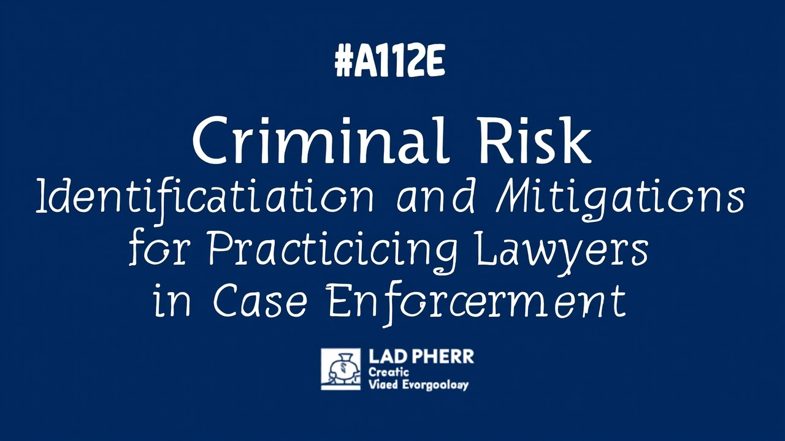
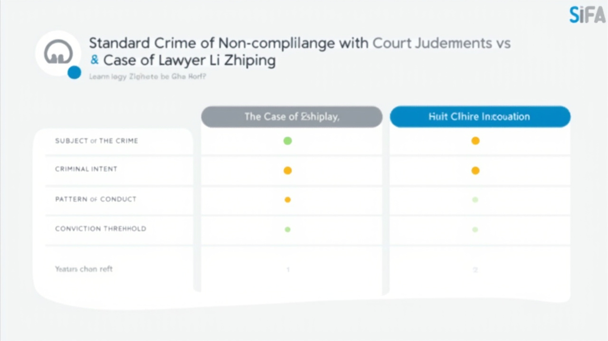
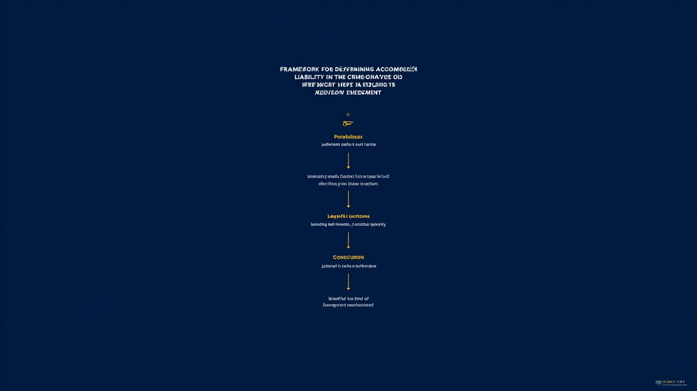
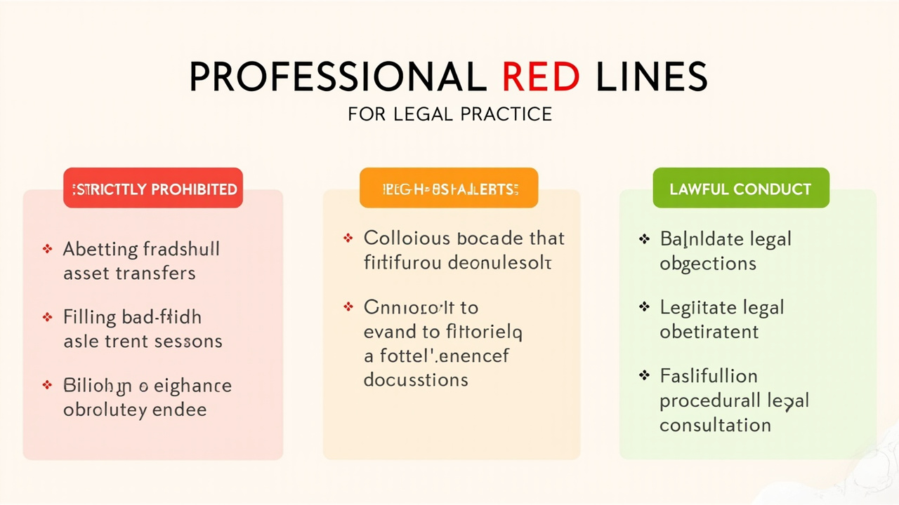
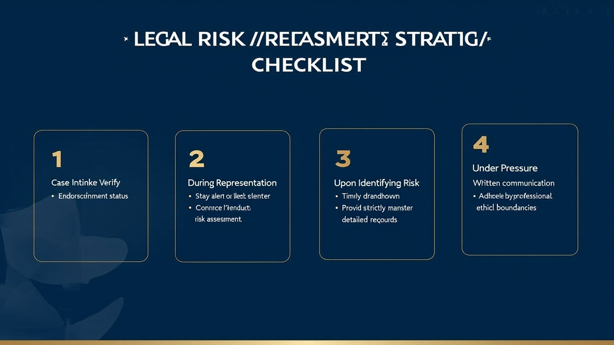

# 执业律师在执行案件中的刑事风险识别与规避

**作者：汤康康**

---

<!-- 配图：标题页 -->


## 引言：案件概述

李志萍律师拒执罪案（（2024）苏0281刑初112号）是一起极具警示意义的执业律师刑事风险案件。本案中，执业律师李志萍在代理被执行人参与执行程序期间，明知当事人存在生效判决确定的执行义务，仍通过教唆、帮助转移财产等方式阻挠执行，最终被认定为拒不执行判决、裁定罪的共犯，被依法追究刑事责任。

这一案件再次提醒我们：**律师执业并非"免罪金牌"，在执行程序中超越正当代理边界的行为，同样可能触及刑事红线。**

## 一、案情对比：本案与拒执罪类案的相似性

| 对比要素 | 普通拒执罪 | 李志萍律师案 |
|----------|-----------|--------------|
| **犯罪主体** | 被执行人（自然人/单位） | 律师（被执行人的代理人） |
| **犯罪故意** | 直接故意：逃避执行 | 共同故意：帮助当事人逃避执行 |
| **行为模式** | 本人转移财产、虚假申报 | 教唆、指使当事人转移财产 |
| **入罪门槛** | "有能力执行而拒不执行，情节严重" | 通过共同犯罪理论，将帮助行为纳入规制 |
| **特殊情节** | — | 律师身份；认罪认罚 |

**关键差异**：普通拒执罪的主体是有执行义务的被执行人；而律师作为代理人本身没有执行义务，但通过共同犯罪理论，律师的帮助行为被纳入刑法规制范围。

<!-- 配图：案情对比表 -->


## 二、案例先行：拒执罪裁判要旨

### 1. 拒执罪构成要件

根据知识库中《[[Synthesis_罪名精释_拒不执行判决、裁定罪]]》：

| 要素 | 内容 |
|------|------|
| **客体** | 司法机关的正常活动 |
| **客观方面** | 有能力执行而拒不执行判决、裁定 |
| **主体** | 有执行义务的人（含共犯） |
| **主观方面** | 故意 |

### 2. "情节严重"的认定

根据《[[synthesis_腰某林拒不执行判决裁定案]]》（（2021）冀0522刑初16号）：

> "致使判决、裁定无法执行"是指被执行人抗拒执行的行为造成人民法院执行机构无法运用法律规定的执行措施，或者虽然运用了法律规定的各种执行措施，但仍无法执行的情形。

### 3. 共同犯罪的认定

律师之所以构成拒执罪共犯，依据在于：
- 明知当事人有执行义务
- 客观上实施了帮助逃避执行的行为
- 与当事人形成共同故意

<!-- 配图：共犯认定框架 -->


## 三、律师行为是否构成拒执罪的认定标准

### 犯罪论体系分析（两阶层）

#### 第一阶层：违法性层面

| 判断要素 | 律师行为分析 |
|----------|--------------|
| **行为主体** | 执业律师，虽非被执行人，但可成为共犯 |
| **行为类型** | 帮助转移财产、教唆逃避执行 |
| **危害结果 | 致使判决无法执行/申请执行人权益受损 |
| **因果关系** | 律师的帮助行为与被执行人的拒执行为存在直接关联 |

#### 第二阶层：有责性层面

| 判断要素 | 律师行为分析 |
|----------|--------------|
| **责任能力 | 具备完全刑事责任能力 |
| **主观故意 | 明知存在执行义务，仍故意帮助逃避 |
| **期待可能性 | 有多种合法途径代理，却选择帮助拒执 |
| **违法性认识 | 应当知道拒执行为违法 |

### 结论

律师在执行案件中的以下行为**可能**构成拒执罪共犯：

| 风险行为 | 罪名认定 | 典型场景 |
|----------|----------|----------|
| **教唆、指点当事人转移财产** | 拒执罪共犯 | 明知有执行义务，建议转移存款/房产 |
| **代理起草虚假执行异议** | 拒执罪共犯/虚假诉讼罪 | 无正当理由反复提起异议拖延执行 |
| **隐匿/销毁财产线索** | 拒执罪共犯/帮助毁灭证据罪 | 代理期间帮助隐匿被执行人财产信息 |
| **虚构债务关系转移资产** | 拒执罪共犯/虚假诉讼罪 | 炮制虚假诉讼调解或执行异议 |

## 四、律师执行案件刑事风险的法律条件分析

### 1. 拒执罪共犯的认定条件

```
【前提】被执行人确有执行能力
    ↓
【行为】律师实施了下述帮助行为之一：
    ├── 教唆当事人转移、隐匿财产
    ├── 为当事人转移财产提供法律方案
    ├── 代理提起虚假执行异议/复议
    ├── 隐匿、销毁财产凭证
    └── 其他帮助逃避执行的行为
    ↓
【故意】律师与被执行人有共同故意
    ↓
【结果】导致判决无法执行/情节严重
    ↓
【定性】拒执罪共犯
```

### 2. 律师执业的合法边界

| 合法执业行为 | 违法边界行为 |
|--------------|--------------|
| 代理提出合法执行异议 | 无正当理由反复提起异议拖延执行 |
| 代理申请执行和解 | 教唆当事人转移财产后再和解 |
| 代理核实财产线索 | 帮助隐匿、销毁财产凭证 |
| 提供法律咨询、程序指引 | 指点当事人规避执行、逃避债务 |
| 代理财产申报、说明情况 | 伪造、虚假申报财产状况 |

## 五、本案特殊性与风险防范启示

### 本案特殊性

1. **律师身份的特殊性**：执业律师具有法律专业知识，更应知晓拒执行为的法律后果
2. **共同犯罪的认定**：律师虽无执行义务，但帮助行为可构成共犯
3. **认罪认罚的适用**：本案适用认罪认罚从宽，律师当庭认罪

### 风险防范策略

#### 执业红线清单

| 序号 | 绝对禁止行为 |
|------|--------------|
| 1 | 不得教唆、指使当事人转移、隐匿财产 |
| 2 | 不得为当事人转移财产提供法律方案或操作指引 |
| 3 | 不得代理提起无正当理由的虚假执行异议 |
| 4 | 不得隐匿、销毁涉及被执行人财产的证据材料 |
| 5 | 不得与当事人通谋逃避执行 |

<!-- 配图：执业行为红线 -->


#### 合规执业建议

```
✅ 接收代理时：核实案件执行状态，评估执业风险
✅ 代理期间：对当事人转移财产的要求保持高度警惕
✅ 提供意见时：仅提供合法范围内的程序性建议
✅ 发现风险时：及时退出代理，保留执业记录
✅ 遇到压力时：优先选择书面沟通，保留证据
```

## 结语

李志萍律师案是一记警钟。律师执业自由是有边界的，这个边界就是法律的明文规定。在执行程序中，律师应当：

1. **坚守执业底线** — 不教唆、不帮助当事人逃避执行
2. **保持职业审慎** — 对当事人的违法要求保持警惕
3. **留存执业记录** — 书面沟通、保留证据
4. **及时风险切割** — 发现风险时果断退出代理

法律的尊严和执业的安全，都依赖于每一位律师对法律底线的坚守。

<!-- 配图：风险防范策略清单 -->


---

**相关法律依据：**

- 《[[中华人民共和国刑法]]》第313条（拒不执行判决、裁定罪）
- 《[[entity_最高人民法院 最高人民检察院关于办理拒不执行判决、裁定刑事案件适用法律若干问题的解释]]》
- 《[[20220105_律师代理民商事案件的刑事风险防范操作指引2022]]》

**Tags：** #执业律师 #刑事风险 #拒执罪 #执行程序 #共同犯罪
